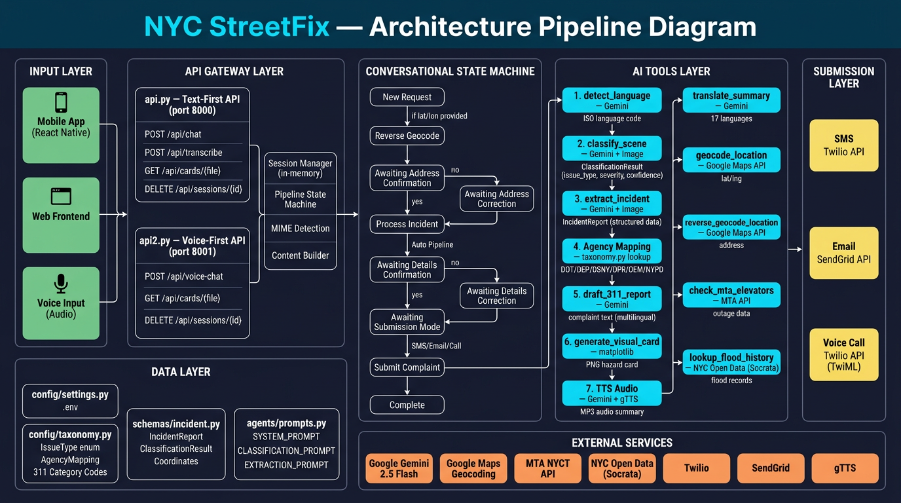

# NYC StreetFix

**AI-Powered Multimodal 311 Co-Pilot for New York City**

NYC StreetFix helps New Yorkers report street-level infrastructure issues — potholes, flooding, illegal dumping, broken signals, accessibility barriers — by accepting photos, voice recordings, and text descriptions. It produces structured incident reports, professional 311 complaint drafts, visual hazard cards, multilingual summaries, and submits complaints via SMS, email, or automated phone call.

Built with **Google Gemini 2.5 Flash**, **FastAPI**, **Twilio**, **SendGrid**, and **NYC Open Data**.

---

## Architecture



The system runs two parallel FastAPI servers that drive a multi-step conversational pipeline. Every AI tool call is powered by Google Gemini.

### Input Layer

Users interact through a **React Native mobile app**, **web frontend**, or **voice input**. All clients send multimodal payloads (images, audio, text, GPS coordinates) to the API gateway.

### API Gateway Layer

| Server | Port | Mode | Primary Endpoint |
|--------|------|------|------------------|
| `api.py` | 8000 | Text-first | `POST /api/chat` |
| `api2.py` | 8001 | Voice-first | `POST /api/voice-chat` |

**`api.py` — Text-First API** exposes:
- `POST /api/chat` — main chat turn (text + files + optional lat/lon)
- `POST /api/transcribe` — standalone audio transcription
- `GET /api/cards/{filename}` — serve generated PNG cards and MP3 audio
- `DELETE /api/sessions/{session_id}` — reset a session

**`api2.py` — Voice-First API** exposes:
- `POST /api/voice-chat` — voice-first chat turn (auto-transcribes audio input, TTS on every response)
- `GET /api/cards/{filename}` — serve cards/audio
- `DELETE /api/sessions/{session_id}` — reset a session

Both servers share: in-memory session management, pipeline state machine, MIME detection, and content builders.

### Conversational State Machine

Each session progresses through a guided pipeline with user confirmation at key checkpoints:

```
New Request (image + text + optional GPS)
    │
    ├── [if lat/lon provided] ──→ Reverse Geocode (Google Maps)
    │                                    │
    │                          Awaiting Address Confirmation
    │                           ├── yes ──→ Process Incident
    │                           └── no ───→ Awaiting Address Correction ──→ Process Incident
    │
    ├── [image only] ──→ Auto Pipeline (immediate)
    │
    └── [text/audio only] ──→ General LLM Conversation
                                    │
                          Process Incident (Auto Pipeline)
                                    │
                          Awaiting Details Confirmation
                           ├── yes ──→ Awaiting Submission Mode
                           │              ├── SMS ──→ Submit (Twilio)
                           │              ├── Email → Submit (SendGrid)
                           │              └── Call ─→ Submit (Twilio TwiML)
                           └── no ───→ Awaiting Details Correction
                                          └──→ back to Awaiting Details Confirmation
```

### AI Tools Layer (Auto-Pipeline)

The core intelligence runs 7 sequential tool calls:

| Step | Tool | Engine | Output |
|------|------|--------|--------|
| 1 | `detect_language` | Gemini | ISO 639-1 language code (17 languages supported) |
| 2 | `classify_scene` | Gemini + Image | `ClassificationResult` — issue type, severity, safety risk, confidence |
| 3 | `extract_incident` | Gemini + Image | `IncidentReport` — structured incident data with summary |
| 4 | Agency Mapping | `taxonomy.py` lookup | Routes to DOT / DEP / DSNY / DPR / OEM / NYPD |
| 5 | `draft_311_report` | Gemini | Professional 311 complaint text (bilingual if non-English user) |
| 6 | `generate_visual_card` | matplotlib | PNG hazard card with severity badge, location, agency, photo |
| 7 | TTS Audio | Gemini + gTTS | MP3 spoken summary for voice responses |

### Supporting Tools

| Tool | External Service | Purpose |
|------|-----------------|---------|
| `translate_summary` | Gemini | Translate reports into 17 NYC community languages |
| `geocode_location` | Google Maps Geocoding API | Address text → lat/lng coordinates |
| `reverse_geocode_location` | Google Maps Geocoding API | lat/lng → street address |
| `check_mta_elevators` | MTA NYCT API | Live elevator/escalator outage data (cached 5 min) |
| `lookup_flood_history` | NYC Open Data (Socrata) | 311 flood complaint history within 500m / 90 days |

### Submission Layer

| Method | Service | Details |
|--------|---------|---------|
| SMS | Twilio | Text message with complaint summary |
| Email | SendGrid | Full formatted 311 report email |
| Voice Call | Twilio (TwiML) | Automated voice call reading the report |

### Data & Configuration Layer

| Module | Contents |
|--------|----------|
| `config/settings.py` | Pydantic `BaseSettings` loading API keys from `.env` |
| `config/taxonomy.py` | 26 `IssueType` enums, `AGENCY_MAPPING`, `CATEGORY_311_CODES`, supported languages |
| `schemas/incident.py` | `IncidentReport`, `ClassificationResult`, `Coordinates` Pydantic models |
| `agents/prompts.py` | `SYSTEM_PROMPT`, `CLASSIFICATION_PROMPT`, `EXTRACTION_PROMPT`, few-shot examples |
| `agents/orchestrator.py` | Google ADK-based `NYCStreetFixOrchestrator` (used by Gradio `app.py`) |

### External Services

| Service | Purpose |
|---------|---------|
| Google Gemini 2.5 Flash | Scene classification, incident extraction, report drafting, language detection, translation, TTS script generation |
| Google Maps Geocoding | Forward and reverse geocoding of NYC addresses |
| MTA NYCT API | Elevator/escalator outage data for accessibility routing |
| NYC Open Data (Socrata) | Historical 311 flood/drainage complaint lookup |
| Twilio | SMS delivery and automated voice calls |
| SendGrid | Email delivery of 311 reports |
| gTTS | Text-to-speech audio generation |

---

## Setup

### Prerequisites

- Python 3.11+
- [uv](https://github.com/astral-sh/uv) (recommended) or pip

### Installation

```bash
git clone <repo-url>
cd nyc-street-fix

# Install with uv (recommended)
uv venv
source .venv/bin/activate
uv pip install -e ".[dev]"

# Or with pip
python -m venv .venv
source .venv/bin/activate
pip install -e ".[dev]"
```

### Configure Environment

```bash
cp .env.example .env
```

Edit `.env` with your API keys:

| Variable | Required | Description |
|----------|----------|-------------|
| `GEMINI_API_KEY` | Yes | Google AI Studio API key — [get one here](https://aistudio.google.com/) |
| `GOOGLE_MAPS_API_KEY` | Yes | Google Maps Platform key with Geocoding API enabled |
| `MTA_API_KEY` | No | MTA developer API key for elevator/escalator status |
| `NYC_OPEN_DATA_APP_TOKEN` | No | NYC Open Data app token for higher rate limits |
| `TWILIO_ACCOUNT_SID` | No | Twilio account SID (for SMS/call submission) |
| `TWILIO_API_KEY_SID` | No | Twilio API key SID |
| `TWILIO_API_KEY_SECRET` | No | Twilio API key secret |
| `TWILIO_PHONE_NUMBER` | No | Twilio phone number (E.164 format) |
| `SENDGRID_API_KEY` | No | SendGrid API key (for email submission) |

---

## Running the APIs

### Text-First API (port 8000)

```bash
uvicorn api:app --host 0.0.0.0 --port 8000 --reload
```

### Voice-First API (port 8001)

```bash
uvicorn api2:app --host 0.0.0.0 --port 8001 --reload
```

### Gradio Demo (app.py)

```bash
python app.py
```

---

## API Usage Examples

### Chat (text + image + GPS)

```bash
curl -X POST http://localhost:8000/api/chat \
  -F "text=There's a huge pothole here" \
  -F "session_id=my-session" \
  -F "lat=40.7128" \
  -F "lon=-74.0060" \
  -F "files=@pothole.jpg"
```

### Voice Chat (audio input)

```bash
curl -X POST http://localhost:8001/api/voice-chat \
  -F "session_id=my-session" \
  -F "files=@recording.m4a"
```

### Transcribe Audio

```bash
curl -X POST http://localhost:8000/api/transcribe \
  -F "file=@recording.m4a"
```

### Reset Session

```bash
curl -X DELETE http://localhost:8000/api/sessions/my-session
```

---

## Programmatic Usage

### Classify a Scene

```python
import asyncio
from tools.classify_scene import classify_scene

async def main():
    result = await classify_scene(
        image_path="demo/sample_images/open_manhole.jpeg",
        description="Open manhole cover on the sidewalk"
    )
    print(result.issue_type, result.severity, result.confidence)

asyncio.run(main())
```

### Run Full Orchestrator Journey

```python
import asyncio
from agents.orchestrator import NYCStreetFixOrchestrator

async def main():
    orchestrator = NYCStreetFixOrchestrator()
    incident = await orchestrator.run_full_journey(
        description="This drain keeps flooding every time it rains.",
        location_text="Corner of Newark Ave and Grove St",
        image_path="demo/sample_images/drain.jpg",
        translate_to=["es", "zh"],
        visual_card_output_path="demo/output/visual_card.png",
    )
    print(incident.model_dump_json(indent=2))

asyncio.run(main())
```

---

## Demo

```bash
# Mock mode (no API keys required)
python demo/demo_script.py --mock

# Live mode (requires API keys in .env)
python demo/demo_script.py

# With an image
python demo/demo_script.py --image demo/sample_images/open_manhole.jpeg
```

Outputs are saved to `demo/output/`:
- `incident.json` — full structured incident record
- `complaint.txt` — 311-ready complaint text
- `visual_card.png` — shareable hazard card
- `translations.json` — multilingual summaries

---

## Development

### Run Tests

```bash
pytest
pytest -v                    # verbose
pytest tests/test_e2e.py     # end-to-end
```

### Lint and Format

```bash
ruff check .
ruff format .
```

---

## Project Structure

```
nyc-street-fix/
├── api.py                     # Text-first REST API (port 8000)
├── api2.py                    # Voice-first REST API (port 8001)
├── app.py                     # Gradio demo interface
├── agents/
│   ├── orchestrator.py        # Google ADK agent + fallback orchestrator
│   └── prompts.py             # System prompt, classification/extraction prompts, few-shot examples
├── config/
│   ├── settings.py            # Pydantic BaseSettings (.env loader)
│   └── taxonomy.py            # IssueType, SeverityLevel, SafetyRisk enums, agency mapping
├── schemas/
│   └── incident.py            # IncidentReport, ClassificationResult, Coordinates models
├── tools/
│   ├── classify_scene.py      # Gemini image/text → ClassificationResult
│   ├── detect_language.py     # Gemini → ISO language code
│   ├── extract_incident.py    # Gemini image/text → IncidentReport
│   ├── geocode_location.py    # Google Maps → lat/lng
│   ├── reverse_geocode_location.py  # lat/lng → address
│   ├── draft_311_report.py    # Gemini → 311 complaint text
│   ├── generate_visual_card.py # matplotlib → PNG hazard card
│   ├── translate_summary.py   # Gemini → translated text
│   ├── check_mta_elevators.py # MTA API → elevator outage data
│   ├── lookup_flood_history.py # NYC Open Data → flood history
│   ├── submit_complaint.py    # SMS/email/call dispatch
│   └── communications.py     # Twilio (SMS + call) and SendGrid (email) clients
├── live/
│   └── stream.py              # TextChat, AudioChat, LiveStream
├── demo/
│   ├── demo_script.py         # CLI demo
│   ├── sample_images/         # Test images
│   └── output/                # Generated outputs
├── tests/                     # pytest test suite
├── docs/
│   ├── architecture.md        # Mermaid diagram
│   └── architecture_diagram.png  # Pipeline diagram
└── pyproject.toml             # Project metadata and dependencies
```

---

## Team

- Anushri Iyer
- Abhishek Bakshi
- Akhilesh Vangala
- Leo Lorence George

---

## License

MIT
