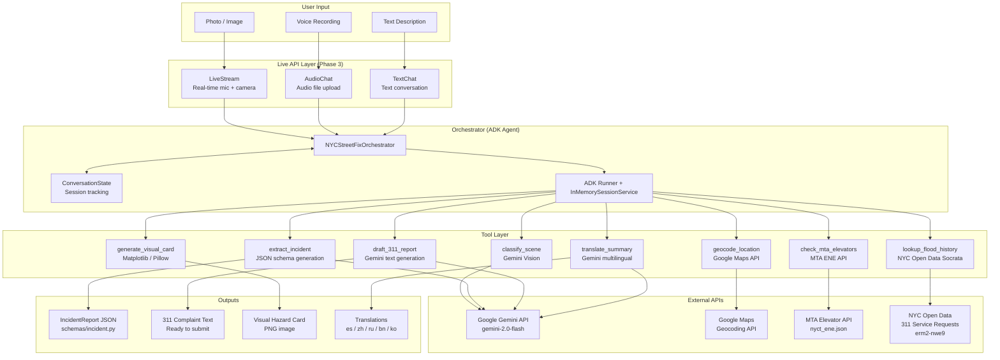

# NYC StreetFix — Architecture

## Overview

NYC StreetFix is a multimodal 311 co-pilot built with Google Gemini and the Agent Development Kit (ADK).
It accepts photos, voice recordings, and text descriptions of NYC street issues, then produces structured
incident reports, 311 complaint drafts, visual hazard cards, and multilingual summaries.

## System Architecture



## Component Details

### Orchestrator (`agents/orchestrator.py`)

The `NYCStreetFixOrchestrator` is the central coordinator. It uses Google ADK to manage:
- **Agent**: `gemini-2.0-flash` with all tools registered
- **Session management**: `InMemorySessionService` tracks conversation state per session ID
- **Runner**: `Runner` executes tool calls and manages the agent loop

The `ConversationState` dataclass tracks the current step in the user journey:
`greeting → collecting_image → collecting_location → generating_report → complete`

### Tools

| Tool | File | Description |
|------|------|-------------|
| `classify_scene` | `tools/classify_scene.py` | Sends image + description to Gemini Vision; returns `ClassificationResult` with confidence score |
| `extract_incident` | `tools/extract_incident.py` | JSON schema-constrained generation; returns fully populated `IncidentReport` |
| `geocode_location` | `tools/geocode_location.py` | Calls Google Maps Geocoding API; returns `Coordinates` or `None` |
| `draft_311_report` | `tools/draft_311_report.py` | Gemini text generation; returns professional complaint string |
| `generate_visual_card` | `tools/generate_visual_card.py` | Matplotlib/Pillow PNG card with severity color coding |
| `translate_summary` | `tools/translate_summary.py` | Gemini translation for es/zh/ru/bn/ko |
| `check_mta_elevators` | `tools/check_mta_elevators.py` | MTA ENE API with 5-minute in-memory cache |
| `lookup_flood_history` | `tools/lookup_flood_history.py` | Socrata/NYC Open Data 311 history via bounding box query |

### Schemas (`schemas/incident.py`)

Two core Pydantic v2 models:

- **`IncidentReport`**: The complete incident record including type, severity, risk, location, agency, complaint text, translations, and external data
- **`ClassificationResult`**: Output of `classify_scene` with confidence score and follow-up questions

### Configuration (`config/`)

- **`settings.py`**: Pydantic `BaseSettings` loaded from `.env`; cached via `@lru_cache`
- **`taxonomy.py`**: Enums for `IssueType`, `SeverityLevel`, `SafetyRisk`; dicts mapping types to agencies and 311 codes

### Live API Layer (`live/stream.py`)

Three classes for different input modalities:

| Class | Phase | Description |
|-------|-------|-------------|
| `TextChat` | P0/P1 | Standard Gemini chat, stateful conversation history |
| `AudioChat` | P2 | Files API upload + Gemini audio understanding |
| `LiveStream` | P3 | Stub — requires full Live API setup (see below) |

## Live API Setup (Phase 3)

Full real-time streaming with `LiveStream` requires:

1. **PyAudio or sounddevice** for microphone capture
2. **A camera library** (OpenCV or similar) for video frame capture
3. **The BidiGenerateContent Live API endpoint** — currently available via `google-genai` SDK
4. **Audio playback** (pyaudio or similar) for spoken responses
5. A dedicated asyncio event loop managing audio I/O queues

Example architecture for full Live API:
```
Microphone → PyAudio stream → asyncio queue → BidiGenerateContent
Camera → OpenCV frames → asyncio queue → BidiGenerateContent
BidiGenerateContent → text response → TTS or display
BidiGenerateContent → audio response → PyAudio playback
```

## Data Flow: Full Journey

```
User: "This drain keeps flooding every time it rains" + photo
                    ↓
          classify_scene(image, description)
                    ↓
          ClassificationResult(issue_type=clogged_catch_basin, confidence=0.88)
                    ↓
          extract_incident(image, description, location_text)
                    ↓
          IncidentReport(issue_type, severity, safety_risk, summary)
                    ↓
          geocode_location("Newark Ave and Grove St")
                    ↓
          Coordinates(lat=40.7178, lng=-74.0431)
                    ↓
          draft_311_report(incident)
                    ↓
          "Catch basin at Newark Ave & Grove St blocked..."
                    ↓
          generate_visual_card(incident, output_path)
                    ↓
          visual_card.png (800x600, severity-coded)
                    ↓
          translate_summary(summary, "es") + translate_summary(summary, "zh")
                    ↓
          {es: "Una alcantarilla...", zh: "雨水篦子..."}
                    ↓
          lookup_flood_history(40.7178, -74.0431)
                    ↓
          {count: 4, last_reported: "2026-03-01", ...}
```

## Agency Routing

| Issue Type | Agency |
|------------|--------|
| Pothole | DOT / 311 |
| Clogged Catch Basin | DEP / 311 |
| Flooding | DEP / OEM |
| Illegal Dumping | DSNY / 311 |
| Broken Traffic Signal | DOT / 311 |
| Cracked Sidewalk | DOT / 311 |
| Accessibility Barrier | DOT / 311 |
| Fallen Tree | DPR / 311 |
| Street Light Outage | DOT / 311 |
| Graffiti | DSNY / 311 |

## Directory Structure

```
nyc-streetfix/
├── agents/          # ADK orchestrator and prompts
├── config/          # Settings and taxonomy enums
├── demo/            # Demo script + sample data
├── docs/            # Architecture documentation
├── live/            # Text/Audio/LiveStream classes
├── schemas/         # Pydantic data models
├── tests/           # pytest test suite
└── tools/           # Individual tool implementations
```
